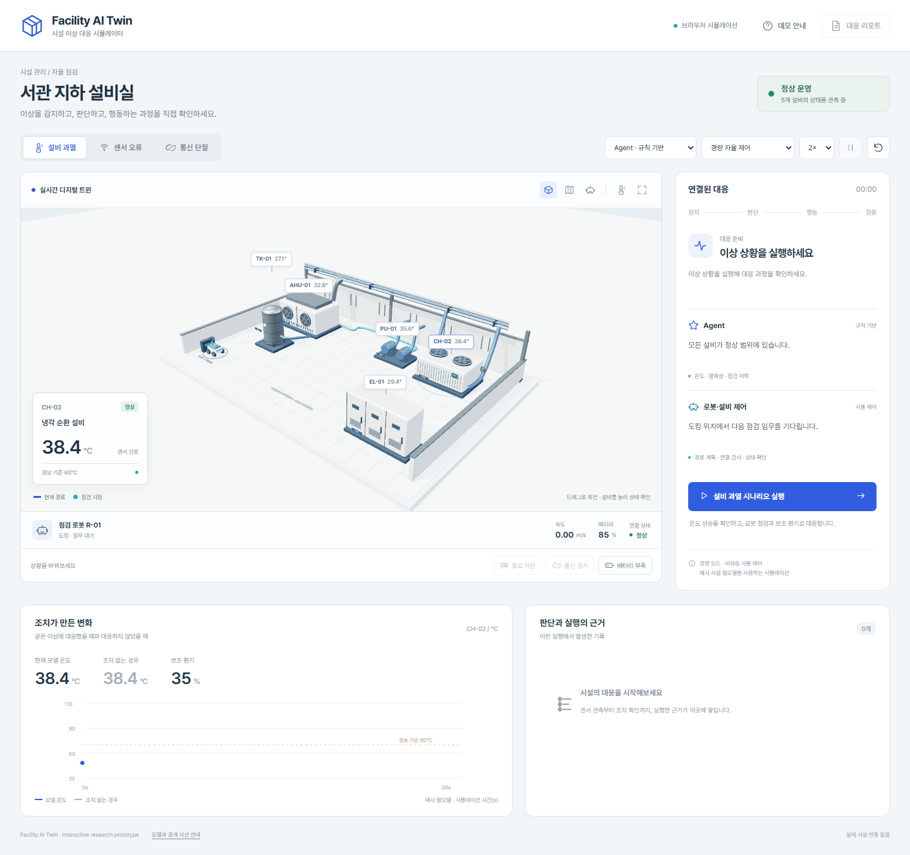

# Facility AI Twin

시설 이상을 **감지 → 판단 → 현장 점검 → 조치 → 검증 → 복귀**로 연결하는 웹 MVP입니다. 한국어 설명과 실행 근거를 함께 보여주며, Unity·Unreal 설치 없이 PC와 모바일 브라우저에서 실행합니다.

## 바로 실행

Node.js 22.12 이상이 필요합니다. 처음 한 번 의존성을 설치합니다.

    cd C:\CodexProj\facility-ai-twin
    npm ci
    npm run dev

브라우저에서 **http://localhost:5180/** 을 엽니다.

Windows에서는 의존성 설치 후 아래 실행기로 서버와 로컬 Agent 브리지를 함께 열 수 있습니다.

    powershell -ExecutionPolicy Bypass -File .\Launch-Demo.ps1

실행기가 시작한 백그라운드 서버는 아래 명령으로 종료합니다. 다른 터미널에서 실행한 서버는 해당 터미널에서 Ctrl+C로 종료합니다.

    powershell -ExecutionPolicy Bypass -File .\Stop-Demo.ps1

기본 데모에는 API 키나 별도 Agent 서버가 필요하지 않습니다. 동일 Wi-Fi의 모바일은 터미널에 표시된 Network 주소와 5180 포트로 접속할 수 있습니다. 학교·공유 네트워크에서는 장치 간 통신 제한과 Windows 방화벽 설정에 따라 접근이 달라집니다.

## 보여줄 수 있는 동작

| 상황 | Agent의 판단 | 로봇·설비 동작 |
|---|---|---|
| 설비 과열 | 온도와 독립 열화상 교차 확인 | 점검 지점 이동 → 관측 → 환기 85% → 안정화 확인 → 복귀 |
| 센서 오류 | 온도 신호와 열화상 불일치 확인 | 현장 점검, 환기 유지, 센서 재교정 요청 기록 |
| 통신 단절 | 연결 복구 후 상태 재확인 | 주행 명령 0, 복구 버튼을 누른 뒤 재개 |
| 통로 차단 | 통행 가능한 구역 갱신 | A* 경로 재계산, 장애물 우회 |
| 배터리 부족 | 20% 이하에서 임무 보류 | 출동·주행 정지, 충전 상태 복구 후 재개 |

설비 선택, 시설 회전·평면·로봇 추적 카메라, 예시 열화상, 1/2/4배 시간, 일시정지, 초기화, 실행 리포트와 JSON 다운로드를 지원합니다. 모바일에는 화면 하단 실행 버튼이 있습니다.

## 실제 Agent를 노트북에서 연결

별도 터미널에서 실행합니다.

    npm run agent:bridge

localhost 화면의 Agent 선택 메뉴에서 **Codex · 로컬 CLI** 또는 **Hermes · 로컬 CLI**를 고릅니다. 설치된 프로그램과 기존 로그인·모델 설정을 사용합니다. 앱에 API 키를 저장하지 않습니다. CLI의 모델 호출은 설정된 서비스에 따라 인터넷과 사용량이 필요할 수 있습니다.

Agent는 관측 JSON에서 최초 점검 계획과 한국어 근거를 반환합니다. 응답 대기 동안 시뮬레이션 시간을 멈춥니다. 브라우저와 브리지가 허용된 대상·조치 및 센서·배터리 제약을 검증한 뒤 실행합니다. 잘못된 결과나 연결 실패 시 보류하고 이유를 표시합니다. 규칙 기반으로 자동 전환하지 않습니다.

브리지는 127.0.0.1:5181에만 바인딩합니다. Vite의 /agent 프록시, 허용된 localhost Origin, 세션 토큰을 사용하며 공개 사이트나 LAN 클라이언트에서는 CLI를 실행할 수 없습니다. 사용자 입력으로 셸 명령을 받지 않습니다. Codex는 읽기 전용 임시 세션, Hermes는 도구가 없는 전용 프로세스로 실행합니다. 결과는 Git에서 제외되는 .runtime/에 저장합니다.

경로를 자동으로 찾지 못할 때 브리지를 시작하는 터미널에서 설정할 수 있습니다.

    $env:CODEX_CLI_PATH = 'C:\...\codex.exe'
    $env:HERMES_CLI_PATH = 'C:\...\hermes.exe'
    $env:HERMES_AGENT_ROOT = 'C:\...\hermes-agent'
    $env:HERMES_PYTHON_PATH = 'C:\...\hermes-agent\venv\Scripts\python.exe'
    npm run agent:bridge

Hermes 어댑터는 설치된 Python 모듈을 사용해 프로세스 안에 빈 도구 집합을 등록합니다. 설치된 Hermes의 내부 모듈 구조가 바뀌면 어댑터 조정이 필요할 수 있습니다. 사용자 Hermes 설정 파일은 수정하지 않습니다.

## 두 로봇 모드

**경량 자율 제어**는 모바일·발표 기본 모드입니다. A*와 운동학 모델을 사용하며 학습 정책이 아닙니다. 시설 장애물의 여유 폭과 연결·배터리 제한을 적용합니다.

**Go1 보행정책 · 정밀**은 브라우저 MuJoCo 접촉 물리와 공개 ONNX 관절 정책을 실행합니다. 실제 관절·강체 상태를 그리며, 위치 관측을 바탕으로 A* 경로를 추종합니다. 시설 의사결정이나 내비게이션 정책을 새로 강화학습한 결과는 아닙니다. 자세가 무너지면 실행을 중지합니다.

정밀 모드는 처음 선택할 때 MuJoCo·ONNX WASM과 Go1 자산 약 35 MB를 불러옵니다. 모바일 성능은 기기에 따라 달라집니다. 경량 모드는 이 자산을 미리 다운로드하지 않습니다.

## GitHub Pages 배포

이 프로젝트는 정적 배포용입니다. 저장소에 소스를 올리고 GitHub 저장소 Settings → Pages → Source를 **GitHub Actions**로 설정하면 .github/workflows/pages.yml이 main 브랜치에서 테스트·빌드 후 배포합니다. 저장소 이름에 맞게 상대 경로를 사용하므로 /facility-ai-twin/ 같은 하위 경로에서도 실행할 수 있습니다.

    npm test
    npm run build
    npm run preview

공개 페이지에서는 규칙 기반 Agent와 두 로봇 모드를 사용할 수 있습니다. 로컬 CLI는 노트북 localhost에서 시연합니다. 현재 이 작업에서 원격 저장소 생성이나 외부 배포는 수행하지 않았습니다.

## 기술 구성과 확장

- Three.js: 절개된 설비실, 장비, 배관, 점검 로봇과 상태 표시.
- Simulation: 시간 기반 상태 전이, 센서·열화상 관측, 열모델, 개입, 실행 기록.
- MuJoCo + ONNX Runtime: 선택적 Go1 물리·보행 정책 실행.
- Local CLI bridge: 최초 점검 계획 요청·검증, 취소·타임아웃·동시 실행 제한.
- 테스트: 대응 순서, 센서 오류, 장애물, 통신·배터리 제약, 리포트 독립 복사, Agent 판단 검증, HTTP 브리지 접근 제약.

[발표 진행안](docs/DEMO.md), [학교 PC·Docker·텔레그램 확장 설계](docs/LOCAL_AGENTS.md), [디자인 방향](docs/DESIGN.md), [공개 자산 고지](THIRD_PARTY_NOTICES.md)를 참고하세요.

[MVP 검증 기록](docs/VERIFICATION.md)에 자동 테스트와 실제 브라우저·CLI 검증 결과를 기록했습니다.

## 현재 구현의 범위

시설 형상과 열모델은 예시입니다. 센서·열화상 값은 합성 관측이며 실제 카메라나 설비에서 수집하지 않습니다. 환기 명령과 센서 교정 요청도 시뮬레이션·실행 기록에 반영합니다. 실제 ICTWAY 플랫폼·BMS·로봇·텔레그램에 연결되지 않았습니다. 조치하지 않은 온도는 같은 초기 조건의 단순 열모델 비교값입니다.

초파리 뇌 연구는 향후 감각 통합·장애물 회피 정책을 동일 환경에서 비교하는 연구 항목입니다. 이 MVP에 초파리 커넥톰이 탑재되었거나 산업 안전·현장 제어 성능이 검증되었다고 주장하지 않습니다.

새 코드의 라이선스는 Apache-2.0이며 공개 모델·정책·라이브러리·폰트에는 각각의 라이선스가 적용됩니다.
